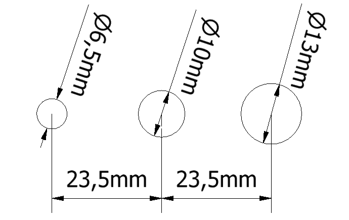

# Monitor Blanking

A TTL-controlled hardware switch designed to blank monitor displays for use in behavioural experiments.

> **Note:** This device modifies existing monitors. Some tuning may be required depending on the model.


## 🔧 Features

- Electrically isolated TTL input (up to 1 MHz)
- Sub-1 µs switching time
- Adjustable backlight brightness
- Manual override switch for testing/debugging
- Supports up to 15 W output power

## 🌐 View Online (eCAD)

View the complete electronic design project online via [Altium 365 Viewer](https://sainsburywellcomecentre.github.io/fablab/):

[](https://sainsburywellcomecentre.github.io/fablab/)

## 🚀 Getting Started


## 📁 Project Structure

```bash
├── eCAD/
│   ├── Assembly/
│   │   ├── BOM.xlsx
│   │   └── pick and place.csv
│   ├── Drawing/
│   │   ├── 2d.dxf
│   │   └── 3d.step
│   ├── Fabrication/
│   │   ├── Gerber/
│   │   └── NC Drill/
│   ├── Source/
│   └── Schematic.pdf
├── mCAD/
│   ├── 3DP/
│   │   ├── ring.stl
│   │   ├── button.stl
│   │   └── base.stl
│   ├── Source/
│   └── panel_drill.dxf


```

### `eCAD/`

Contains Altium Designer source files, schematics, fabrication outputs, and documentation.

### `mCAD/`

Contains 3D mechanical designs (Inventor 2025) and printable STL models.

## 🛠️ Build It Yourself

### 1. Get the Parts

> For users without in-house fabrication capabilities.

- **PCB**: Order from [JLCPCB](https://jlcpcb.com/) (includes assembly service). Refer to the [Bill of Materials (BOM)](eCAD/Assembly/BOM.xlsx) for manual assembly.
- **3D Prints**: Print the mechanical components using any 3D printing service. JLCPCB also offers 3D printing at competitive prices.

See the [JLCPCB Assembly Tutorial](https://jlcpcb.com/capabilities/assembly) for step-by-step instructions.

### 2. Assembly & Installation

1. Place the **ring** under the potentiometer and insert it into the PCB before soldering. This ensures alignment with the BNC connector.
2. Insert the **button** into the tactile switch.
3. Attach the **base** underneath the PCB.
4. Open the monitor’s rear panel and locate the 6-pin cable connected to the motherboard. Disconnect it and plug it into the white 6-pin connector on the circuit board.
5. Connect the monitor's **live and neutral wires** to the 2-pin screw terminal on the board.
6. Drill the back panel of the monitor to accommodate the BNC, potentiometer, and pushbutton.

   Use `mCAD/panel_drill.dxf` or refer to the manual drill dimensions below:

   <p align="center">
       
   </p>

7. Mount the PCB to the panel and reassemble the monitor.

## ⚙️ Fine-Tuning the Blanking Driver

The blanking driver circuit is designed to support a wide range of monitor backlight types. However, to ensure optimal performance, you may need to fine-tune the **VLED** voltage.

### 🔧 Voltage Adjustment Guidelines

- Press the pushbutton to force the monitor **ON**, then use the trimmer **R9** to adjust the **VLED** until the backlight reaches the desired brightness level.
- The **VLED** voltage can be adjusted within the range of **41 V to 61 V**.
  > The recommended **VLED** is at least **2 V higher** than the forward voltage of the backlight panel.

<div align="center">
  
</div>

## 💻 Software Requirements

To access the source CAD projects:

- **Altium Designer 24** or newer  
  Academic licenses available via [Altium Education](https://www.altium.com/education/)
- **Autodesk Inventor Pro 2025** or newer  
  Academic licenses via [Autodesk Education](https://www.autodesk.com/education/home)

## 📜 License

This project is licensed under [Creative Commons Attribution-ShareAlike 4.0 International](http://creativecommons.org/licenses/by-sa/4.0/).

You are free to:

- **Share** — copy and redistribute the material in any medium or format
- **Adapt** — remix, transform, and build upon the material for any purpose

Under the following terms:

- **Attribution** — Give appropriate credit, link to the license, and indicate changes.
- **ShareAlike** — Distribute your contributions under the same license.
- **No additional restrictions** — Don’t apply legal or technological measures that prevent others from doing anything the license permits.

> For the full legal text, see [License.txt](License.txt).
