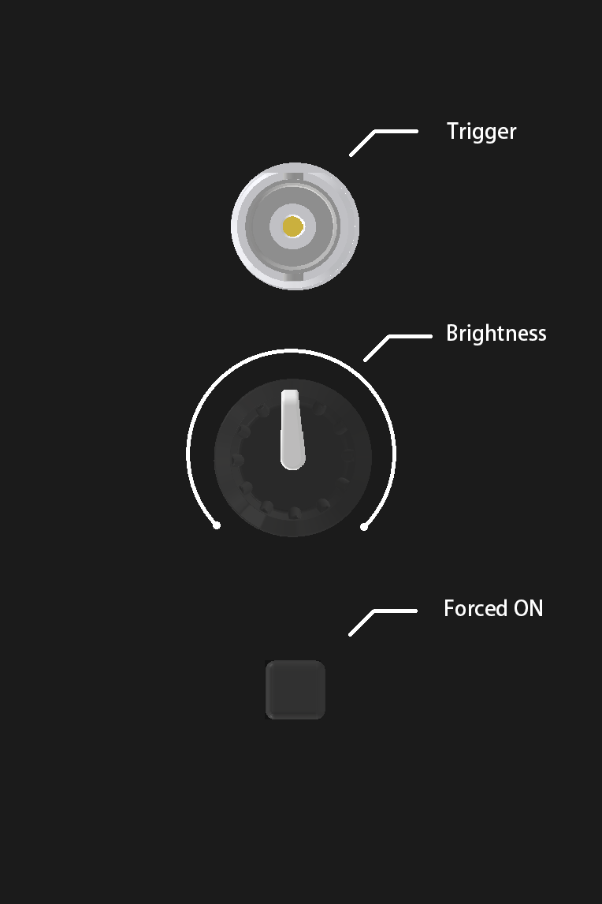

# Monitor Blanking

A TTL-controlled switch to blank a monitor display, for use in behavioural experiments.


## Features

- Isolated TTL input up to 1MHz
- Switch on-off time < 1us
- Adjustable brightness
- Forced-on switch for testing and debugging

## Getting Started



## Folder Structure

The project is structured as follows:

```bash
├── eCAD/
│   ├── Assembly/
│   │   ├── BOM.xlsx
│   │   └── pick and place.csv
│   ├── Drawing/
│   │   ├── 2d.dxf
│   │   └── 3d.step
│   ├── Fabrication/
│   │   ├── Gerber
│   │   └── NC Drill
│   ├── Source/
│   └── Schematic.pdf
├── mCAD/
│   ├── 3DP/
│   └── Source/

```

### eCAD

This folder contains an Altium Designer project and its output files.

### mCAD

This folder contains the complete mechanical design in Inventor 2025 project format.

## Build on your own

## Requirements

To access the soruce CAD projects, the required software for the project is as follows

- Altium Designer 24 or newer. Academic licenses can be obtained by contacting [Altium Education](https://www.altium.com/education/)
- Inventor Pro 2025 or newer. Academic licenses can be obtained by contacting [Autodesk Education](https://www.autodesk.com/education/home)

## License

Sainsbury Wellcome Centre hardware is released under [Creative Commons Share-alike 4.0 International](http://creativecommons.org/licenses/by-sa/4.0/).

Note: This is a human-readable summary of (and not a substitute for) the [license](License.txt).

You are free to:

Share — copy and redistribute the material in any medium or format
Adapt — remix, transform, and build upon the material
for any purpose, even commercially.
The licensor cannot revoke these freedoms as long as you follow the license terms.
Under the following terms:

Attribution — You must give appropriate credit, provide a link to the license, and indicate if changes were made. You may do so in any reasonable manner, but not in any way that suggests the licensor endorses you or your use.
ShareAlike — If you remix, transform, or build upon the material, you must distribute your contributions under the same license as the original.
No additional restrictions — You may not apply legal terms or technological measures that legally restrict others from doing anything the license permits.
Notices:

You do not have to comply with the license for elements of the material in the public domain or where your use is permitted by an applicable exception or limitation.
No warranties are given. The license may not give you all of the permissions necessary for your intended use. For example, other rights such as publicity, privacy, or moral rights may limit how you use the material.

## Acknowledgments
